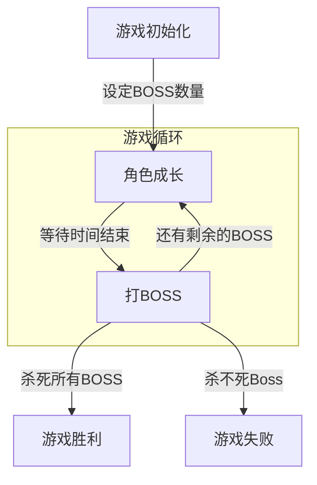

# MagicSea

MagicSea Game From War3 Map

## 目录结构

- **Doc/**
- **UE4_Project/**
  - **Config/**
  - **Content/**
    - **Blueprints/**
    - **Effects/**
    - **Levels/**
    - **Models/**
    - **Textures/**
  - **Source/**
  - **Plugins/**
  - MagicSea.sln
  - MagicSea.uproject
- README.md

## 游戏背景

多元宇宙之主遭遇刺杀，新生代霸主将颠覆了原有的和平秩序，让爱好和平的生物彼此仇视、开战，罪恶由此诞生。

为了光复往日的繁荣景象，为了让各次元重现勃勃生机，魔幻海宇宙的民众拉拢各次元的义士后组建了复兴军，踏上了以魔幻海为起点的征途。

浩瀚无尽的宇宙空洞无比，

## 游戏流程

### 角色成长

