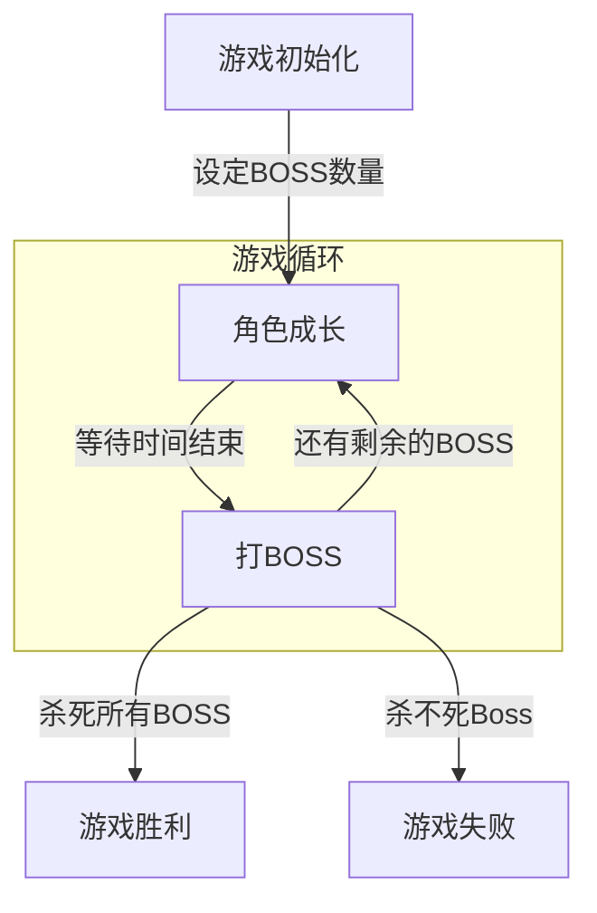

# MagicSea

MagicSea Game From War3 Map

=======
## 目录结构

- **Doc/**
- **UE4_Project/**
  - **Config/**
  - **Content/**
    - **Blueprints/**
    - **Effects/**
    - **Levels/**
    - **Models/**
    - **Textures/**
  - **Source/**
  - **Plugins/**
  - MagicSea.sln
  - MagicSea.uproject
- README.md
- 

