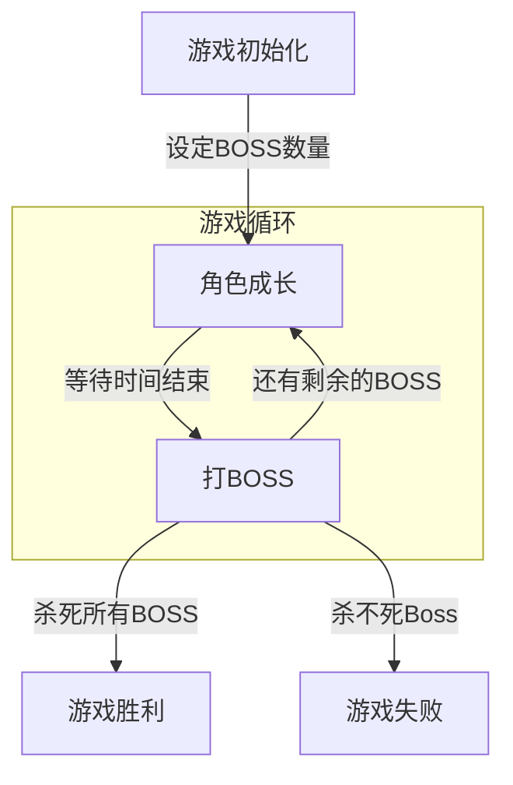

# MagicSea

MagicSea Game From War3 Map

## 目录结构

- **Doc/**
- **UE4_Project/**
  - **Config/**
  - **Content/**
    - **Blueprints/**
    - **Effects/**
    - **Levels/**
    - **Models/**
    - **Textures/**
  - **Source/**
  - **Plugins/**
  - MagicSea.sln
  - MagicSea.uproject
- README.md

## 游戏背景

多元宇宙之主遭遇刺杀，新生代霸主将颠覆了原有的和平秩序，让爱好和平的生物彼此仇视、开战，罪恶由此诞生。

为了光复往日的繁荣景象，为了让各次元重现勃勃生机，魔幻海宇宙的民众拉拢各次元的义士后组建了复兴军，踏上了以魔幻海为起点的征途。

浩瀚无尽的宇宙空洞无比，

## 游戏流程

### 角色成长

- 

## 出怪系统

### 海盗入侵

在每隔$N_{pirate}$秒后会有一波海盗入侵，战胜海盗后获得一张刮刮乐或者遗物选择权。玩家死亡后海盗不消失。

### 龙虾入侵

在每隔$N_{lobstar}$秒会出现一只龙虾，战胜龙虾后获得木材。玩家死亡后龙虾不消失

### 无限挑战塔（目前看起来是无限的）

由玩家主动发起并挑战的关卡，每一波有$N_{tower}$只小怪，**战胜**小怪后**获得1张刮刮乐**。每5波有一只Boss怪替换小怪，**战胜**boss后可以**获得遗物选择权**。

**玩家死亡**后，boss与小怪消失，需要**重新发起挑战**。

重新发起挑战后，boss与小怪会**重新随机**并生成。

### 金币人

金币人在游戏一开始便存在，金币人拥有嗜血技能，可以给任意小怪或Boss增益。

战胜金币人后获得**金币**与**金币加成**。玩家死亡后金币人不消失。

金币人死亡后每隔$N_{coinman}$秒重新生成，每次重新生成后金币人等级提升、属性增强，但是技能不变。

### 装备怪

玩家主动召唤装备怪，召唤时消耗金币。

装备怪分不同的等级，等级不同的怪可以召唤的时间也不一致。

战胜装备怪后随机掉落不同等级的装备。

玩家死亡后装备怪不会消失

## 装备系统

## 抽奖系统

在杀死每一波小怪后会得到一张刮刮乐卡，刮刮乐卡可以随机获取以下奖励。

- 特等奖
  - 全属性系数+0.1（只出现一次）
  - 杀敌数+2000（只出现一次）
  - 木材+300（只出现一次）
  - 杀敌积分（食物）+1（只出现一次）
  - 全属性成长+1（只出现一次）
- 稀有属性
  - 力量加成
  - 敏捷加成
  - 智力加成
- 幸运奖
  - 再来三次
- 安慰奖
  - 木材奖励
  - 杀敌数（食物）奖励
  - 金币奖励（5K ~ 50K）
  - 属性奖励
  - 神秘奖励

## 遗物系统

在杀死每一个小Boss后会有一次遗物拾取的机会，玩家可以从三个遗物中选取一个来增强自己。
